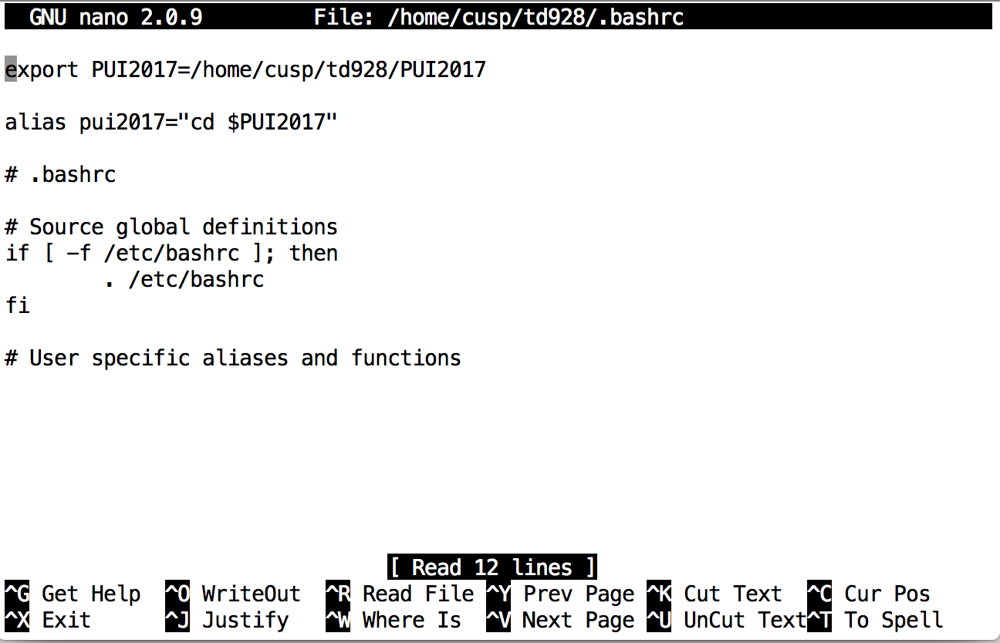

#Assignment 2:

*explanation for homework*

1. first create a new dirctory in name PUI2017 in my home directory. Then use pwd to get the full path to the directory

```
mkdir PUI2017

pwd

```

2. Then create an environmental variable in /.bashrc named PUI2017

```
nano ~/.bashrc

export PUI2017=/home/cusp/td928/PUI2017

```


3. Making an alias for changing to the directory of the environmental variable

```
alias pui2017='cd PUI2017'

```


