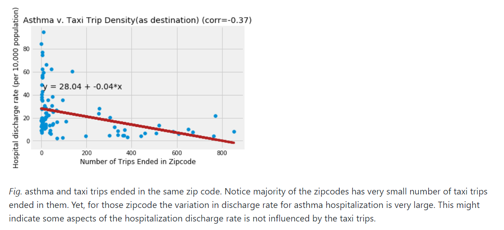

Review by Zhiao Zhou (zz1749)

**CLARITY**  
I could easily see that Te is trying to find the relationship between asthma hospitalization rate and numbers of trips ended in the corresponding zipcode (kind of confusing but interesting as well). However, he created a small figure so a majority of scatter points are overlaying with each other which would be some kind of ambiguous. In addition, he didn't indicate which time periods the data he used was of. At last, a legend would be better added.
 
**AESTHETHIC**  
The colors are chosen appropiately which help me to focus on the right elements. However, a bigger size of figure, smaller labels and higher postion of the title would make the plot more beautiful.

**HONESTY**  
He indicates that the plot might show some aspects of the hospitalization discharge rate is not influenced by the taxi trips. However, the discharge rate is a complicated thing that could be affected by various factors regarding either epidemiology or demographics so the influence couldn't be so easily spotted by a simple linear regression. I think a model with controlled variables would be better.